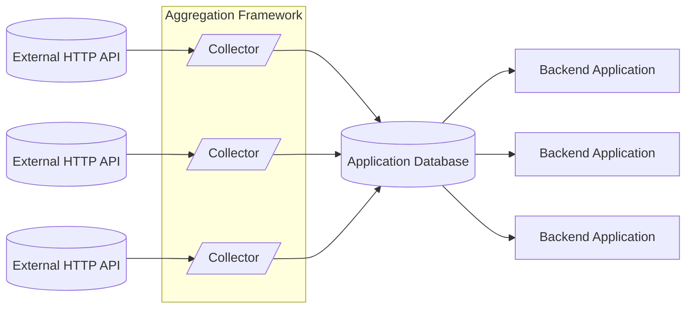
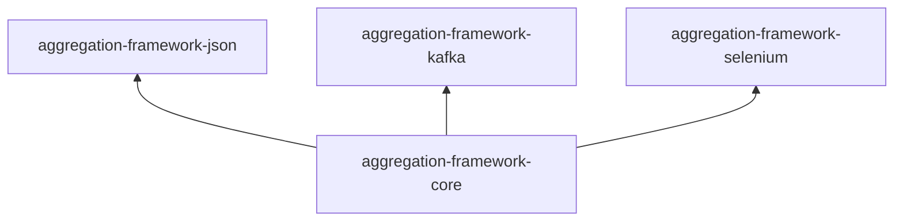

# aggregation-framework

A Swiss-army knife library for scraping and processing data from the web. Provides a unified interface for multiple
different HTTP clients, and convenience functionality for parsing and preprocessing data for your applications to use.

- Quickly build HTTP requests for a variety of data formats and APIs.
- Parse common data formats such as XML, HTML, and JSON.
- Push your aggregated data automatically to your preferred database (such as Kafka, MySQL, or Postgres).
- Write your own collectors for non-standard data formats.



## Get Started

Add Aggregation Framework and your preferred extensions to your project. For sbt:

```sbt
// add Forge as a resolver
resolvers += "forge.cptlobster.dev" at "https://forge.cptlobster.dev/api/packages/cptlobster/maven"

libraryDependencies += "dev.cptlobster" %% "aggregation-framework-core" % "0.1.0-SNAPSHOT"
// for JSON parsing
libraryDependencies += "dev.cptlobster" %% "aggregation-framework-json" % "0.1.0-SNAPSHOT"
```

*Note: This is not published to any Maven repositories yet, you will need to build locally first. Development builds 
will be published at https://forge.cptlobster.dev once actions are properly setup. This may be published to Maven
Central in the future when it is more stable.*

To create a consumer, [follow the tutorial](docs/tutorial.md).

## Target Artifacts

The project is split into a collection of packages. These are split so that you don't have to install a ton of external
packages that you aren't going to use.

The core package is located under `/core` in this repository, and the extension packages are located under their own
subdirectories in `/ext`. Each extension package has its own README that describes it in more detail.



## Development
This project uses sbt for project and dependency management. Install sbt via your preferred package manager; if you use
IntelliJ, it can manage sbt for you.

To build the entire project:

```shell
sbt compile
```

## License
This program is licensed under the [GNU General Public License, version 3](LICENSE.md).

*This program is free software: you can redistribute it and/or modify it under the terms of the GNU General Public
License as published by the Free Software Foundation, either version 3 of the License, or (at your option) any later
version.*<br />
*This program is distributed in the hope that it will be useful, but WITHOUT ANY WARRANTY; without even the implied
warranty of MERCHANTABILITY or FITNESS FOR A PARTICULAR PURPOSE.  See the GNU General Public License for more details.*
<br />
*You should have received a copy of the GNU General Public License along with this program. If not, see
https://www.gnu.org/licenses/.*