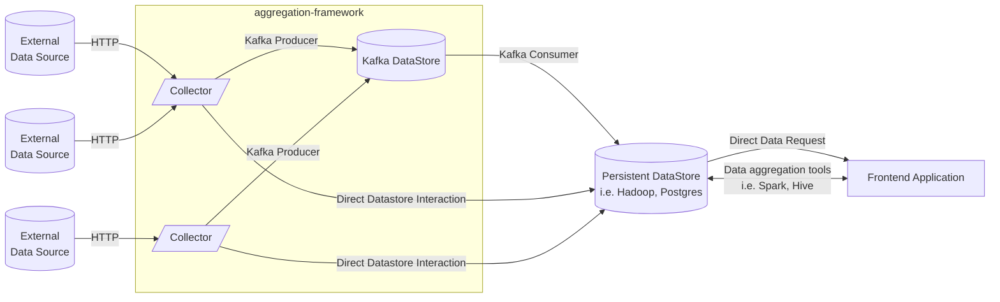
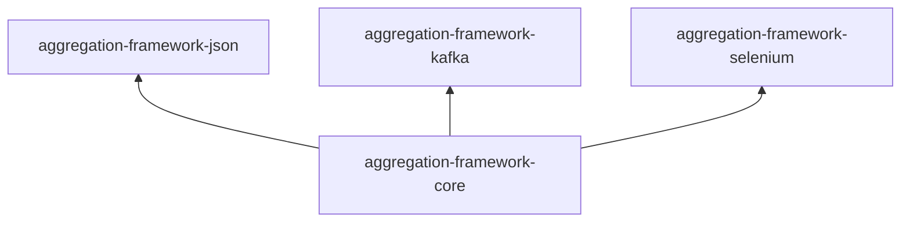

# aggregation-framework

A Swiss-army knife data scraping and processing tool written in Scala.
- Quickly build HTTP requests for a variety of data formats and APIs.
- Parse common data formats such as XML, HTML, JSON, and more.
- Push your aggregated data to Kafka topics for reliable realtime storage, or other datastores (such as Postgres or
  Hadoop)
- Write your own collectors for non-standard data formats.



## Modules

The project is split into a collection of modules. These are split so that you don't have to install a ton of external
packages that you aren't going to use.



## Development
This project uses sbt for project and dependency management. Install sbt via your preferred package manager; if you use
IntelliJ, it can manage sbt for you.

```shell
sbt build
```

## License
This program is licensed under the [GNU General Public License, version 3](LICENSE.md).

*This program is free software: you can redistribute it and/or modify it under the terms of the GNU General Public
License as published by the Free Software Foundation, either version 3 of the License, or (at your option) any later
version.*<br />
*This program is distributed in the hope that it will be useful, but WITHOUT ANY WARRANTY; without even the implied
warranty of MERCHANTABILITY or FITNESS FOR A PARTICULAR PURPOSE.  See the GNU General Public License for more details.*
<br />
*You should have received a copy of the GNU General Public License along with this program. If not, see
https://www.gnu.org/licenses/.*