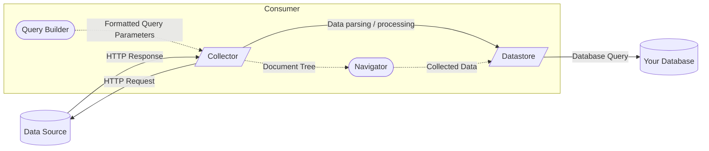

# Project Design Philosophy
Aggregation Framework is designed to operate as a component of larger projects to standardize interactions with various
HTTP data sources. This will allow you to implement your data model swiftly and easily, and pivot to different
collection methods without needing to extensively learn new libraries and frameworks. To summarize it more crudely, it
is several different HTTP/web interaction libraries in a trenchcoat.

The goals of this project are:
- Simplify interacting with complex online data sources / APIs.
- Standardize interfaces of many different HTTP libraries and frameworks as much as possible.
- Standardize parsing / constructing different data formats (XML, HTML, JSON, etc.) as much as possible.
- Don't provide rigid classes that force you into specific paradigms; make everything an extension of your existing (or
  newly written) code.

This document will explain the various parts of an Aggregation Framework data consumer.

## Base Components

These are required for implementing a data consumer.

### Collector

This is the low-level component that interacts with your HTTP API. It's a standardized wrapper over other HTTP clients
(such as sttp, scala-scraper, or Selenium), that you will adapt to connect to your intended endpoint, read and parse the
data, and collect it in a form for the rest of your project to use.

### Datastore

This component handles pushing your data to the backend database, such as Kafka, Postgres, HDFS, or others. This can
have a two-way connection, in case you need to correct for repeated data.

## Additional Components

While you could go without these, you'll likely have an easier time with using this library if you use our additional
component traits / classes.

### Navigator

Each library used in this project has its own unique method of navigating document trees (json4s has its own functions
that behave differently from scala-scraper's, selenium just does its own thing). The navigator classes attempt to
standardize these into a common interface.

### Query Builder

These extend your Collector traits to provide programmatic ways to build queries in domain-specific languages (DSLs),
such as GraphQL or HTTP GET requests. These come in two parts:
- The Mixin trait is implemented by your data consumer; This will parse your query parameters and pass them to the HTTP
  request accordingly.
- The Builder classes are used to assemble your queries, and are passed to the `query()` function in your consumer (this
  function will be augmented by the Mixin trait to support the query builder).